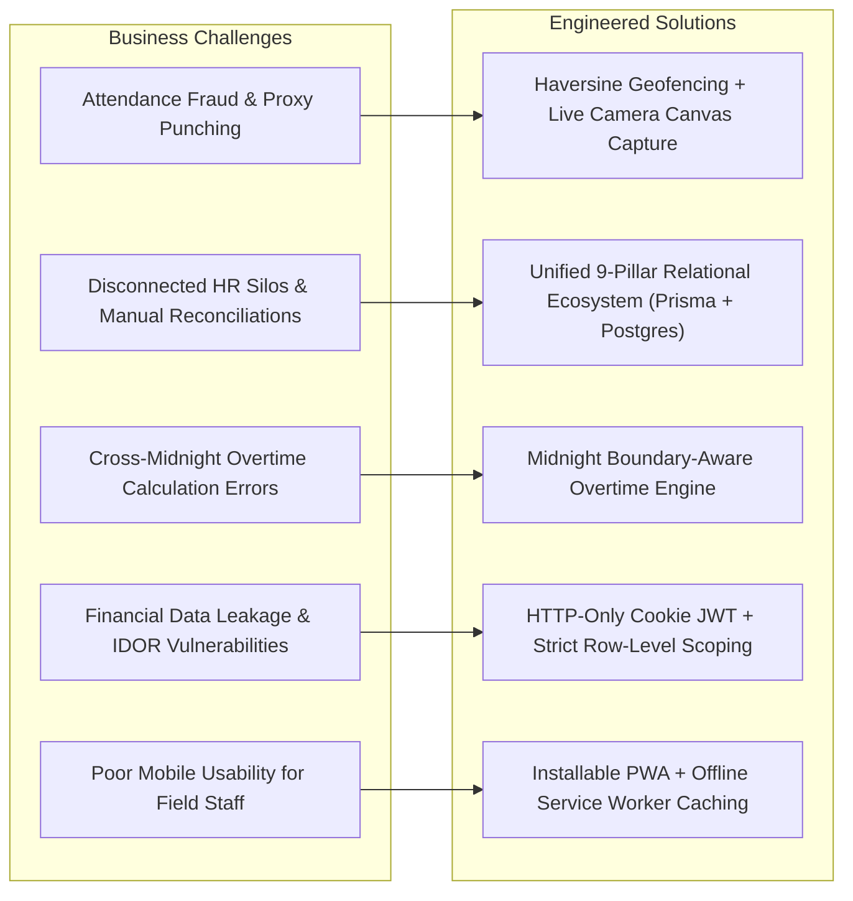

# Portfolio Case Study: Enterprise HR & Attendance Management System

## 🌟 Project Overview

**Enterprise HR & Attendance Management System** is a mission-critical, enterprise-grade human capital and workforce management platform. It bridges the gap between field workforce attendance tracking and corporate back-office workflows (payroll, leave management, overtime processing, employee expense claims, recruitment pipeline, and executive decision-making).

---

## 🎯 Problems Solved & Engineering Solutions

---

## 🏛 Architecture & Engineering Highlights

### 1. Zero-Trust Security & RBAC / IDOR Protection
* **Session Layer**: Authentication uses cryptographically signed JWT tokens stored exclusively in `HTTP-Only`, `SameSite=Lax`, and `Secure` cookies. No access tokens or bearer keys are ever exposed to client-side `localStorage` or `sessionStorage`.
* **Row-Level Ownership Scoping**: Every database lookup verifies the authenticated `userId` / `employeeId` extracted from the cryptographically verified JWT payload, preventing any parameter tampering (IDOR attacks).
* **Role Guards**: Strict NestJS guards (`JwtAuthGuard`, `RolesGuard`) enforce role policies (`ADMIN`, `HR`, `EMPLOYEE`).

### 2. Geolocation Anti-Spoofing & Camera Verification
* **Haversine Distance Algorithm**: Calculates true spherical distance between the employee's browser GPS coordinates and the designated office coordinate geofence:
  $$d = 2R \cdot \arcsin\left(\sqrt{\sin^2\left(\frac{\Delta\phi}{2}\right) + \cos(\phi_1)\cos(\phi_2)\sin^2\left(\frac{\Delta\lambda}{2}\right)}\right)$$
* **Live Camera Canvas Capture**: Attendance selfies are captured directly from live video streams without permitting arbitrary file dialog uploads, eliminating static photo injection attacks.
* **Server-Side File Validation**: Image buffers are validated against Magic Bytes (`FF D8 FF` for JPEG, `89 50 4E 47` for PNG, `52 49 46 46` for WebP).

### 3. Cross-Midnight Overtime & Dynamic Shift Rosters
* Shift schedules and overtime requests seamlessly support shifts spanning across midnight (e.g. 22:00 to 06:00 WIB).
* Approved overtime minutes are dynamically fed into the monthly Payroll Engine.

### 4. End-to-End Recruitment to Employee Conversion
* Vacancy management with a 6-stage applicant tracking pipeline (`APPLIED` $\rightarrow$ `SCREENING` $\rightarrow$ `INTERVIEW` $\rightarrow$ `SELECTED` $\rightarrow$ `HIRED` $\rightarrow$ `REJECTED`).
* One-click conversion from `HIRED` candidate to active `Employee` and system `User`, preserving applicant records without redundant data entry.

### 5. Multi-Pillar Real-Time HR Analytics
* Executive and departmental analytics aggregated directly from PostgreSQL:
  1. Headcount growth & status distributions.
  2. Attendance, punctuality, and absence rates.
  3. Daily attendance stacked timeline charts.
  4. Leave usage & type breakdowns.
  5. Shift roster allocations.
  6. Overtime volume & approved hours.
  7. Payroll gross spend, base salary, allowance, deductions, and overtime pay.
  8. Expense reimbursement category distribution.
  9. Recruitment candidate conversion funnel.
* **Discipline & Punctuality Compliance Index (0–100)**: Quantitative scoring reflecting punctuality and attendance reliability.

---

## 💻 Tech Stack Summary

| Dimension | Technologies |
| :--- | :--- |
| **Frontend** | Next.js 16 (App Router), React 19, TypeScript, Tailwind CSS v4, Lucide React, Leaflet Maps |
| **Mobile / PWA** | Web App Manifest, Service Worker, Responsive Layout, Touch-Optimized UI |
| **Backend** | NestJS 12, Express Engine, Passport JWT, Class-Validator, Helmet, Throttler |
| **Database** | PostgreSQL 14+, Prisma ORM 6.19.3 |
| **Testing** | Jest, Supertest, Custom End-to-End Regression & Security Suites |

---

## 📈 Key Metrics & Verification Results

* **TypeScript Compilation**: 0 errors (`npx tsc --noEmit`).
* **Backend Build**: Clean NestJS production compilation (`dist/`).
* **Frontend Build**: 62 static and dynamic routes compiled via Next.js Turbopack.
* **Security & IDOR Audit**: 100% pass across all role-based authorization vectors.
* **Timezone Consistency**: Verified across `Asia/Jakarta` (WIB) boundaries and daylight calculations.
